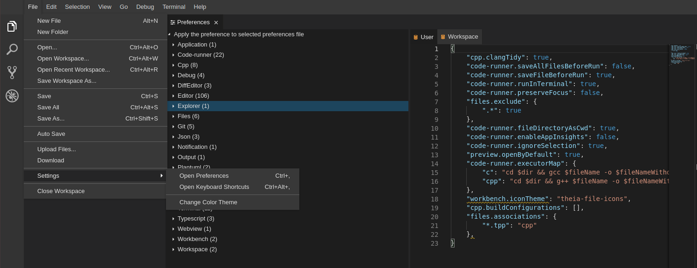

# CPTR 242: Homework Assignment -- Heaps

## Problem Overview

Your task in this assignment is to implement __reheap__ for a Priority Queue based on a heap.
The function __reheap__ functions have been implemented as a recursive function and you task is to write the equivalent function as an iterative function.
The __reheap__ iterative function must be implemented in two ways: up, and down.

Note the file you are using has the extension __tpp__.
This is because you are using a template and it must be include in the header file.
To help designate they difference between implementation and template, the extension has been changed to `tpp`.

## Setting Code.CS Preferences

Code.CS has not been configure to format and code highlight the new template file.
Please add the following lines to your preferences file.
Open the file by going to __File->Settings->Open Preferences__.

```json
    "files.associations": {
        "*.tpp": "cpp"
    },
```



## Solution Specifications

Your solution to this problem must meet the following criteria.

1. Implement the two versions of _reheap_ for a linked implementation in _reheap.tpp_.
    A stub of the function has been given to you.

    ```{c++}
    template <class ItemType>
    void HeapType<ItemType>::ReheapDownIterative(int root, int bottom) {
        // TODO Implement a Iterative ReheapDown Function.
    }

    template <class ItemType>
    void HeapType<ItemType>::ReheapUpIterative(int root, int bottom) {
        // TODO Implement a Iterative ReheapUp Function.
    }
    ```

2. Pass all the tests in Submitty.

## Test Driver

The book describes the operations of priority queues and heaps.
The submitty tests are based on previous test drivers.
It may be helpful to create your own test driver to validate your functions.

## Compiling List Implementations

A simple way to compile them is to list the cpp files after the g++ compiler.
You can run the test by executing the following:

```{sh}
g++ *.cpp & ./a.out
```

Remember you only need to list the cpp files and must be in the local directory.
Since the header files are in the same folder they are included in the _#include_ statement.

The sample files provided don't provide a main or driver function.
If you want to test, you will need to create one.
## Test Driver

The Submitty tests use a test driver similar to the first homework.

In this assignment you may find it helpful to create your own test input for the driver to validate your functions.
A QueueDriver.cpp has been provided to allow a user to run test input.
Please model the method we have used for homework 1 in creating your own test input for the driver.

These are the complete menu options available:

```sh
Select options
  Enqueue. Adds item to queue using recursion.
  Dequeue. Removes item to queue using recursion.
  EnqueueIterative. Adds item to queue using iteration.
  DequeueIterative. Removes item to queue using iteration.
  IsEmpty. Returns whether queue is empty.
  MakeEmpty. Returns the queue to the empty state.
  IsFull. Returns whether queue is full.
  Quit. Quit application.
  Menu. Display menu.
```

The code can be compile by running the `make` command.

Example Input:

```sh
IsEmpty
Enqueue 5
EnqueueIterative 7
Dequeue
DequeueIterative
Quit
```

To test the code, run this command:

```sh
./Queue.out
```

Resulting Standard Output:

```sh
 Command number 1 completed.
 Command number 2 completed.
 Command number 3 completed.
 Command number 4 completed.
 Command number 5 completed.
Testing completed.
```

Resulting `solutions.txt`:

```sh
Sample Test
Queue is empty.
5 is enqueued.
7 is enqueued (iterative).
7 is dequeued.
5 is dequeued (iterative).
```

**You will also find the solution in a `solutions.txt` file while the standard output is primarily for logging.**

## Tips

* You create a text file with all the user input. Then when you run the program you may pass in this file as input.

  ```sh
  Queue.out < sample.txt
  ```

  This is a good way to recreate your test each time you run your program.

## Submission

Your submission must include a `reheap.tpp` file.
All other file `.h` and `.cpp` should remain unchanged.
