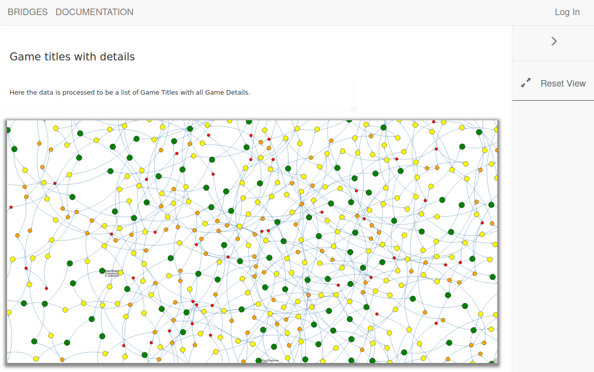

# CPTR 242: Project -- Linked Lists

## Problem Overview

This project will use the BRIDGES API with a game review dataset from IGN.
You be building a sorted linked list using BRIDGES elements, which will enable you to visualize the data structure you are constructing and testing.
Note that the visualization will also be a means to debug your program, as it will let you view your data structure and its contents after each operation.
This dataset contains a collection of game reviews at IGN and is adapted from Reddit User: CDanger (Twitter: @coreyaustinhere), who scraped the data from IGN's website.
The driver will be managing the game review details so you can focus on adding operation to the sorted list.



## Learning Objectives

* Understanding of interval linked list structure
* Able to read C++ library documentation
* Able to create complete tests
* Visualize the data structure using the BRIDGES API

## Resources

* Bridges Site: <http://bridgesuncc.github.io/>
  * Getting Started: <http://bridgesuncc.github.io/bridges_setup.html>
  * API Documentation: <http://bridgesuncc.github.io/doc/cxx-api/current/html/index.html>

## Solution Specifications

Your solution to this problem must meet the following criteria.

1. Implement __PutGame__, __GetGame__, __DeleteGame__, __ResetList__, __GetNextGame__, and __EmptyList__ for the linked sorted list implementation in _GameList.cpp_.
   A class header and function stubs has been given to you.
   Please read the header file for detailed description of the functions.
2. Submitty will be used grade through automated tests and a TA looking at your visualizations.

## Test Driver

The project continues to follow the testing structure from prior homework.
The Submitty tests are based on this test driver.
Here is a sample set of input to get you started.

```txt
PutGame Minecraft
PutGame Tetris
GetLength
PrintList
Visualize
AddX 100
GetLength
Visualize
Quit
```

* Create alternate tests to cover all the test functions
* Create an user input test file to allow for consistent and repeatable testing

## Sign Up For BRIDGES

Please sign up for a BRIDGES account at [Bridges Sign Up](http://bridges-cs.herokuapp.com/signup).
Once you have an account, put your username and the API Sha1 key in the `BridgesUser.h` file.

1. Sign up for (bridges](http://bridges-cs.herokuapp.com/signup)
1. Navigate to your profile.
1. Put your __User Name__ in `BridgesUser.h` file
1. Put your __API Sha1 Key__ in `BridgesUser.h` file

These steps are need to make sure you have access to the Game data and visualization for the project.

## Setup Local IDE

Follow the [Bridges Setup Directions](http://bridgesuncc.github.io/bridges_setup.html) to configure your system.
Please install the libraries in your `student242/include` folder for the `make` file to work properly.
(If you install in another directory, the make file will need to be altered.)

A script has been created for Code.CS.
If you are using a different IDE, take a look at the website for set up details.
You can also look at supplied set up script to see the exact commands which are being used by Code.CS.

If you are using Code.CS, do the following:

```sh
cd student242
./setup_bridges_on_linux.sh
```

## Compiling List Implementations

A _make_ file has been provided to help with compiling your code.
Simply run ```make``` to compile your code after the set up has been completed.
Then execute ```./GameList.out```.
These commands have been tested on Code.CS.

```sh
make
./GameList.out
```

The build files can be cleaned up by running ```make clean```.

## Tips

1. In this project, you will get familiar with reading library documentation.
   Bridges has fairly good documentation and you will need it to figure out the available options for completing this assignment.
2. Your IDE may show red marks due to the fact that it does not know about the BRIDGES library.
   You will still be able to build and run the software, even with these marks.
   Try compiling to see if there is really an issue.
